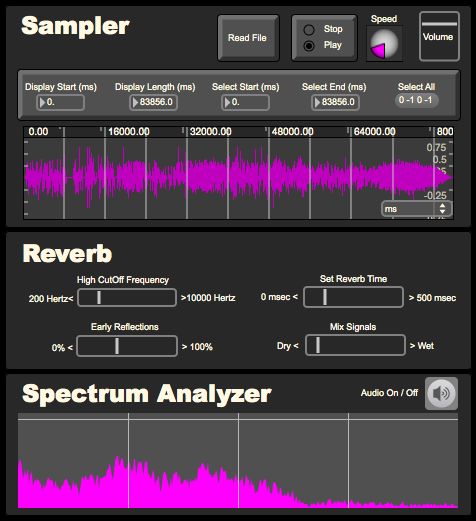
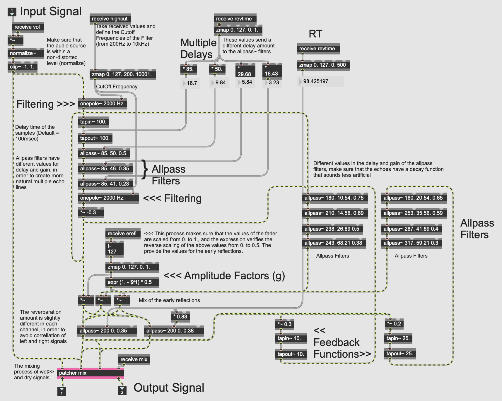

## Reverb Unit

The example below demonstrates how to develop a DSP reverberation algorithm in [Max/MSP](https://cycling74.com/).

Full code on GitHub.

The patch includes a sampler that allows you to open an audio file (in .wav or .aiff file formats), store it in a buffer and reproduce it while it is being processed by the reverberation algorithm.

This reverb unit multiplies short delays and uses their feedback in order to build a dense series of echoes, which in total are able to simulate the phenomenon of reverberation in enclosed spaces. The algorithm uses in addition delays of different sizes to increase the echo density. All-pass filters are connected in a a serial configuration to make sure that the echoes have a smoother response and a better acoustic result.

